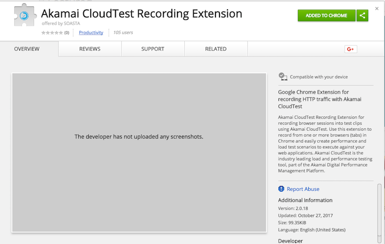

# Clips
The Clip is the basic building block in CloudTest. A Clip is a visual script that is composed of a series of timed or sequenced events (an event can be an http message, a SOAP message or a UI event in a browser). Once edited and debugged, this can be reused for load tests.

Clips can be converted from HTTP(s) and packet-level recordings or be created using the Chrome Recording extension. Clips can also be created manually by adding messages, browser actions, app actions, and other clip elements using the Clip Editor toolbar.

For more info on creating clips check:
https://community.akamai.com/docs/DOC-8832-creating-a-new-clip

### Recordings
CloudTest offers two ways to make HTTP recordings:

  1. Conductor (application based)
  2. Chrome Extension

To start a recording, select the "Clip" folder from the left pane and click the "+" button. There are three three recording possibilities:

  * Extension Recording (Chrome Extension)
  * HTTP Recording (Conductor)
  * Data Packet Recording (rarely used, gets everything on the network)

After creating a recording, it will show in the "Recordings" page showing the raw data. Once you stop the recorder, you can select "Convert to a Clip" and a wizard will show up to transform the recording into a Test Clip. It's also possible to edit the recording and remove unwanted steps to convert it into a clip at a later time from the "Recordings" folder.

HTTPS recording requires that the website being recorded has a valid SSL certificate. This means that:

  * The certificate has not expired.
  * The certificate is assigned to the host name that is being used when creating the recording. In other words, if the SSL certificate is issued to mysite.com, the recording cannot be created using the IP address or an internal host name.

Self-signed certificates are supported, provided that these two requirements are met.
For more info on Recordings check these documents:
https://community.akamai.com/docs/DOC-8801-recording

### Conductor
The Conductor it's a Java desktop application. It acts as a proxy that intercepts all the requests made from the browser to the web application. When the recording starts, it configures the system network settings and adds an HTTP and HTTPS proxy values pointing to the port where the conductor registers itself on localhost (4440).

For HTTPS, the Conductor adds it's own certificate to the PC key-store.  For SSL connections recording, it's needed to have this certificate loaded as the browser will be connecting to an unknown certificate authority. For this reason,loading this SOASTA CA certificate in the machine certificate store as a trusted authority is needed.

For more info about using Conductor for recordings:
https://community.akamai.com/docs/DOC-8816-installing-soasta-conductor

### Chrome Extension
Since CT 57, you can record directly in the browser without installing or routing traffic through the Conductor proxy. You can record activity from just the tab(s) you want, with no risk of picking up HTTP traffic from other tabs or apps such as Skype, Evernote, Dropbox or Slack. This approach also eliminates installation, configuration, and connectivity challenges inherent to a proxy-based approach, especially where tight IT controls are in place.

The recording extension supports:
 * HTTP
 * HTTPS (including WebSockets)

Chrome Extension recording is preferred over Conductor.

The extension can be downloaded fromt he following URL:
https://chrome.google.com/webstore/detail/akamai-cloudtest-recordin/oimgnocmkhifnmlmdmhmipocbkdnhblo

Recording with the extension is slower than with the Conductor. The steps would take a bit longer to appear CloudTest as the recording progresses.

### Clip Editor
Once the Clip has been saved, it can be also edited using the "Clip Editor". The clip can be shown in an "icon" or "list" mode in the editor. This last is preferred as it shows more details about each of the clip steps. Finally, to run the clip you need to create a composition by clicking "Open in Composition".

The clip has system properties that are exposed through Javascript. Custom properties act like variables where you can grab dynamic values from responses so these can be used in following requests. For example, gathering a SESSIONID token and reuse it in following request made to the target application.

You can use the "Session Template Wizard" as an easy way to set up the correct properties values in the scenario of extracting a sessionid in a Clip.

For more info about recording into the Clip Editor:
https://community.akamai.com/docs/DOC-8819-http-recording-into-the-clip-editor
