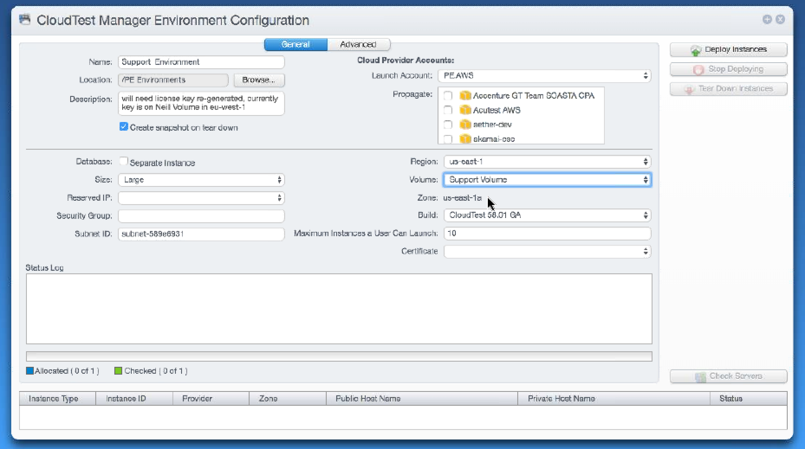
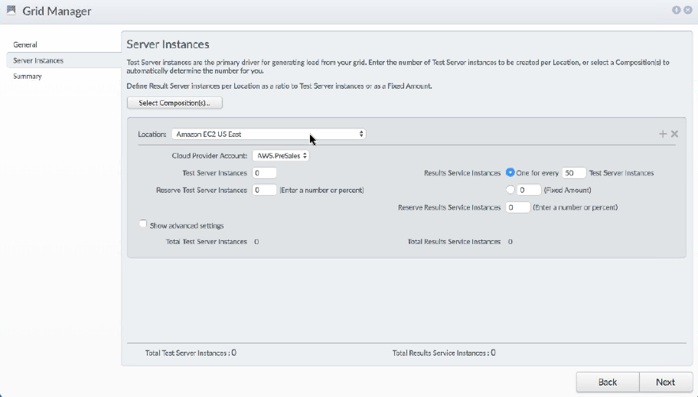
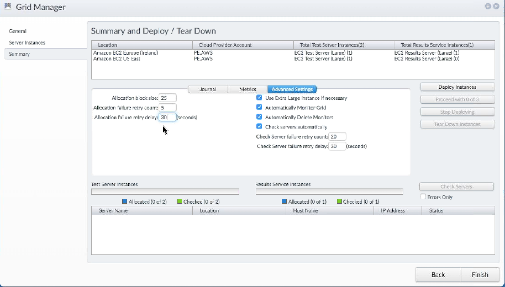

# Load Testing using the Cloud

### CloudTest Manager
It's a special instance of CloudTest hosted in Akamai infrastructure. It keeps track of all customer issued licenses for their own on-premises installations or Cloud-based instances:

https://cloudtestmanager.soasta.com/concerto

Every customer needs to have access and a Tenant created to be able to use CloudTest Manager.

CloudTestManager is an additional menu that exists only in this instance.

### Cloud Providers
The "Cloud Provider Accounts" contain the Cloud provider to run the instances on. The supported providers are:
  - AWS
  - Microsoft Azure
  - Google Cloud
  - RackSpace
  - GoGrid

When creating a "Cloud Provider Account", the user just needs to provide a name for the account and specify the the access key and secret key for API usage of the particular provider (AWS, Azure, etc). Once the user clicks "OK", it will verify the access with the provided credentials.

### Volumes
"Volumes" contain the Elastic Block Storage (EBS) volumes that can be used for the EC2 instances when creating an environment. The volumes are tied to a Region and a Zone. Other attributes tha need to be specified are:
  * Size (GB)
  * Provisioned IOPS (PIOPS)

### Reserved IP address
"Reserved IP addresses" are the Elastic IPs that are fixed and could be attached to the EC2 instances. The IP would be the public IP for the Cloud Provider.

### Data Services
For customers that extensively used CloudTest and have multiple tenants and testing groups, having a single Results database might be insufficient. For this use case, it's possible to create a separate RSDB on the cloud provider for each tenant. This can be done in the "Data Services" page.

### Environments
The "Environments" object contain one particular CloudTest Main setup for creating a load test scenario. When creating an environment, the user needs to define a number of parameters after selecting the Cloud Provider Account in the General Tab:

  * **Propagate:** Automatically adds the selected accounts to the deployed instance. This allows using any of these Cloud Providers to launch Server Grids from the deployed CloudTest Main instance.
  * **Region:** The Cloud provider region where the instances will be hosted.
  * **Volume:** The EBS volumes to be used as disk for the EC2 instances.
  * **Build:** The CloudTest version (normally the last GA version). In the case of AWW, this makes the relation with the CloudTest AMI for the specific version.
  * **Max Instance a User Can Launch:** Self-explaining.
  * **Certificate:** If SSL is used.
  * **Database (Separate Instance):** Can be selected to split the database instance from the Main CT instance.
  * **Size:** Server size depending in the configured "Server Classes" in CloudTest Manager.
  * **Reserved IP:** Elastic IP value.
  * **Security Group:** These are the firewall inbound/outbound rules tied to the EC2 instance. The rules need to guarantee the server instance to deploy can talk to the  Manager instance.
  * **Subnet ID:** This maps to the Virtual Private Cloud subnet (VPC) in AWS. If not defined, will use default value.

The "Advanced Tab" defines additional parameter like:

  * Pending Timeout
  * Allocation Max Retries
  * Allocation Retry Delay
  * Check Server Max Retries
  * Check Server Retry Delay

### Server Classes
Server classes are used within Akamai CloudTest to template "Server Instances" that will be deployed and then torn down in the cloud at test runtime. The Server Classes in "CloudTest Manager" basically provide a mapping table between each Cloud Provider instance types and the server sizes as defined in CT Manager.

For more info, check:
https://community.akamai.com/docs/DOC-9500-server-classes

### Server Grids
The Grid feature is the primary method of launching cloud-based servers in Akamai's CloudTest. Grids allow you to determine how many servers to launch and how to recover from failures when allocating servers from the cloud provider. These are Mastro and Results Database instances that can be deployed to several regions and zones. Server Grids group together a number of server instances in a location that can be used to launch Compositions.

### Grid Manager
Use the Grid Manager to manage elastic, cross-cloud computing resources, used in one or more load tests. The Grid Manager allows you to setup and view your cloud-computing resources, including Load Generators and Results Server instances from multiple locations used.

You can create one or more Grids for use in tests that deploy cloud resources and match those with CloudTest Test Server instances.

When creating a new Server Grid, the following parameters need to be defined:

 * **Location:** Select the Cloud Provider regions
 * **Cloud Provider Account:** Contains the account that have been propagated at deployment time.
 * **Test Server Instances:** Number of Load Generators to deploy.
 * Reserve Test Server Instances
 * **Results Service Instances (One Every "X" Test Server Instances or Fixed Amount):** Launch Results Consolidators instances (normally 1 every 50 LG).
 * Reserve Results Service Instances

There's also a set of "Advanced" settings that can be set for deploying the server grid.

  * Pending timeout.
  * Used Reserved IPs.
  * Severity Group (optional).
  * Server Classes.
  * Use Spot instances if available.
  * Zone Distribution:
    - Let the cloud provider pick the zone for me.
    - All in the same zone.
    - Distribute evenly.

It's possible to add several locations for a Server Grid to deploy multiple server instances distributed across regions and availability zones.

The next step, shows the "Summary" page with the Locations added and the resulting instances to deploy:

There are additional setting in this page that allow automatic creation and deletion of monitors and server checks. Also "Allocation block size" allows submitting requests in parallel to the cloud provider for the creation of instances, by default set to "25". If there are bandwith limitations with the account, it's possible the cloud provider throttles the requests or generates an error. In this case, the block size would need to be reduced.

Once the Grid is deployed, the "Servers" page should show all the instances with the service endpoints already added. The "Check Server(s)" tab could be used to verify when all the instances are rechable and ready.

Also the "Monitors" should be already created if the option of automatic creation was selected in the "Summary" page of the Grid Manager.

For more info about creating and managing Server Grids:
https://community.akamai.com/docs/DOC-8774-creating-a-new-grid
https://community.akamai.com/docs/DOC-8775-managing-grids
